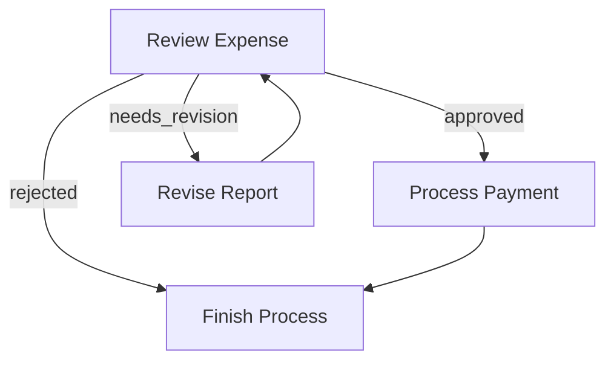
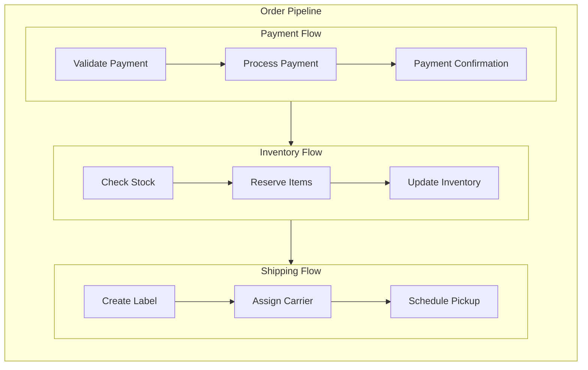

# Agentic Coding: Humans Design, Agents code!

> If you are an AI agent involved in building LLM Systems, read this guide **VERY, VERY** carefully! This is the most important chapter in the entire document. Throughout development, you should always (1) start with a small and simple solution, (2) design at a high level (`docs/design.md`) before implementation, and (3) frequently ask humans for feedback and clarification.
{: .warning }

## Agentic Coding Steps

Agentic Coding should be a collaboration between Human System Design and Agent Implementation:

| Steps                  | Human      | AI        | Comment                                                                 |
|:-----------------------|:----------:|:---------:|:------------------------------------------------------------------------|
| 1. Requirements | ★★★ High  | ★☆☆ Low   | Humans understand the requirements and context.                    |
| 2. Flow          | ★★☆ Medium | ★★☆ Medium |  Humans specify the high-level design, and the AI fills in the details. |
| 3. Utilities   | ★★☆ Medium | ★★☆ Medium | Humans provide available external APIs and integrations, and the AI helps with implementation. |
| 4. Data          | ★☆☆ Low    | ★★★ High   | AI designs the data schema, and humans verify.                            |
| 5. Node          | ★☆☆ Low   | ★★★ High  | The AI helps design the node based on the flow.          |
| 6. Implementation      | ★☆☆ Low   | ★★★ High  |  The AI implements the flow based on the design. |
| 7. Optimization        | ★★☆ Medium | ★★☆ Medium | Humans evaluate the results, and the AI helps optimize. |
| 8. Reliability         | ★☆☆ Low   | ★★★ High  |  The AI writes test cases and addresses corner cases.     |

1. **Requirements**: Clarify the requirements for your project, and evaluate whether an AI system is a good fit. 
    - Understand AI systems' strengths and limitations:
      - **Good for**: Routine tasks requiring common sense (filling forms, replying to emails)
      - **Good for**: Creative tasks with well-defined inputs (building slides, writing SQL)
      - **Not good for**: Ambiguous problems requiring complex decision-making (business strategy, startup planning)
    - **Keep It User-Centric:** Explain the "problem" from the user's perspective rather than just listing features.
    - **Balance complexity vs. impact**: Aim to deliver the highest value features with minimal complexity early.

2. **Flow Design**: Outline at a high level, describe how your AI system orchestrates nodes.
    - Identify applicable design patterns (e.g., [Map Reduce](./design_pattern/mapreduce.md), [Agent](./design_pattern/agent.md), [RAG](./design_pattern/rag.md)).
      - For each node in the flow, start with a high-level one-line description of what it does.
      - If using **Map Reduce**, specify how to map (what to split) and how to reduce (how to combine).
      - If using **Agent**, specify what are the inputs (context) and what are the possible actions.
      - If using **RAG**, specify what to embed, noting that there's usually both offline (indexing) and online (retrieval) workflows.
    - Outline the flow and draw it in a mermaid diagram. For example:
      ```mermaid
      flowchart LR
          start[Start] --> batch[Batch]
          batch --> check[Check]
          check -->|OK| process
          check -->|Error| fix[Fix]
          fix --> check
          
          subgraph process[Process]
            step1[Step 1] --> step2[Step 2]
          end
          
          process --> endNode[End]
      ```
    - > **If Humans can't specify the flow, AI Agents can't automate it!** Before building an LLM system, thoroughly understand the problem and potential solution by manually solving example inputs to develop intuition.  
      {: .best-practice }

3. **Utilities**: Based on the Flow Design, identify and implement necessary utility functions.
    - Think of your AI system as the brain. It needs a body—these *external utility functions*—to interact with the real world:
        <div align="center"></div>

        - Reading inputs (e.g., retrieving Slack messages, reading emails)
        - Writing outputs (e.g., generating reports, sending emails)
        - Using external tools (e.g., calling LLMs, searching the web)
        - **NOTE**: *LLM-based tasks* (e.g., summarizing text, analyzing sentiment) are **NOT** utility functions; rather, they are *core functions* internal in the AI system.
    - For each utility function, implement it and write a simple test.
    - Document their input/output, as well as why they are necessary. For example:
      - `name`: `get_embedding` (`utils/get_embedding.rs`)
      - `input`: `str`
      - `output`: a vector of 3072 floats
      - `necessity`: Used by the second node to embed text
    - Example utility implementation:
      ```rust
      // src/utils.rs
      use anyhow::Result;
      use async_openai::{
          types::{ChatCompletionRequestMessage, ChatCompletionRequestUserMessageArgs, CreateChatCompletionRequestArgs},
          Client,
      };

      pub async fn call_llm(prompt: &str) -> Result<String> {
          let client = Client::new();
          let request = CreateChatCompletionRequestArgs::default()
              .model("gpt-4o")
              .messages(vec![ChatCompletionRequestMessage::User(
                  ChatCompletionRequestUserMessageArgs::default()
                      .content(prompt)
                      .build()?
                      .into()
              )])
              .build()?;
          let response = client.chat().create(request).await?;
          Ok(response.choices[0].message.content.clone().unwrap_or_default())
      }
      ```
    - > **Sometimes, design Utilities before Flow:**  For example, for an LLM project to automate a legacy system, the bottleneck will likely be the available interface to that system. Start by designing the hardest utilities for interfacing, and then build the flow around them.
      {: .best-practice }
    - > **Avoid Exception Handling in Utilities**: If a utility function is called from a Node's `exec()` method, avoid using `try...except` blocks within the utility. Let the Node's built-in retry mechanism handle failures.
      {: .warning }

4. **Data Design**: Design the shared store that nodes will use to communicate.
   - One core design principle for PocketFlow is to use a well-designed [shared store](./core_abstraction/communication.md)—a data contract that all nodes agree upon to retrieve and store data.
      - For simple systems, use an in-memory dictionary.
      - For more complex systems or when persistence is required, use a database.
      - **Don't Repeat Yourself**: Use in-memory references or foreign keys.
      - Example shared store design:
        ```rust
        use serde_json::json;
        use pockeflow_rs::Context;
        
        let mut context = Context::new();
        context.set("user", json!({
            "id": "user123",
            "context": {
                "weather": {"temp": 72, "condition": "sunny"},
                "location": "San Francisco"
            }
        }));
        context.set("results", json!({}));
        ```

5. **Node Design**: Plan how each node will read and write data, and use utility functions.
   - For each [Node](./core_abstraction/node.md), describe its type, how it reads and writes data, and which utility function it uses. Keep it specific but high-level without codes. For example:
     - `type`: Regular (or Batch, or Async)
     - `prep`: Read "text" from the shared store
     - `exec`: Call the embedding utility function. **Avoid exception handling here**; let the Node's retry mechanism manage failures.
     - `post`: Write "embedding" to the shared store

6. **Implementation**: Implement the initial nodes and flows based on the design.
   - 🎉 If you've reached this step, humans have finished the design. Now *Agentic Coding* begins!
   - **"Keep it simple, stupid!"** Avoid complex features and full-scale type checking.
   - **FAIL FAST**! Leverage the built-in [Node](./core_abstraction/node.md) retry and fallback mechanisms to handle failures gracefully. This helps you quickly identify weak points in the system.
   - Add logging throughout the code to facilitate debugging.

7. **Optimization**:
   - **Use Intuition**: For a quick initial evaluation, human intuition is often a good start.
   - **Redesign Flow (Back to Step 3)**: Consider breaking down tasks further, introducing agentic decisions, or better managing input contexts.
   - If your flow design is already solid, move on to micro-optimizations:
     - **Prompt Engineering**: Use clear, specific instructions with examples to reduce ambiguity.
     - **In-Context Learning**: Provide robust examples for tasks that are difficult to specify with instructions alone.

   - > **You'll likely iterate a lot!** Expect to repeat Steps 3–6 hundreds of times.
     >
     > <div align="center"></div>
     {: .best-practice }

8. **Reliability**  
   - **Node Retries**: Add checks in the node `exec` to ensure outputs meet requirements, and consider increasing `max_retries` and `wait` times.
   - **Logging and Visualization**: Maintain logs of all attempts and visualize node results for easier debugging.
   - **Self-Evaluation**: Add a separate node (powered by an LLM) to review outputs when results are uncertain.

## Example LLM Project File Structure

```
my_project/
├── main.rs
├── src/nodes.rs
├── src/flow.rs
├── utils/
│   ├── __init__.rs
│   ├── call_llm.rs
│   └── search_web.rs
├── requirements.txt
└── docs/
    └── design.md
```

- **`requirements.txt`**: Lists the Python dependencies for the project.
  ```
  PyYAML
  pocketflow
  ```

- **`docs/design.md`**: Contains project documentation for each step above. This should be *high-level* and *no-code*.
  ~~~
  # Design Doc: Your Project Name

  > Please DON'T remove notes for AI

  ## Requirements

  > Notes for AI: Keep it simple and clear.
  > If the requirements are abstract, write concrete user stories


  ## Flow Design

  > Notes for AI:
  > 1. Consider the design patterns of agent, map-reduce, rag, and workflow. Apply them if they fit.
  > 2. Present a concise, high-level description of the workflow.

  ### Applicable Design Pattern:

  1. Map the file summary into chunks, then reduce these chunks into a final summary.
  2. Agentic file finder
    - *Context*: The entire summary of the file
    - *Action*: Find the file

  ### Flow high-level Design:

  1. **First Node**: This node is for ...
  2. **Second Node**: This node is for ...
  3. **Third Node**: This node is for ...

  ```mermaid
  flowchart TD
      firstNode[First Node] --> secondNode[Second Node]
      secondNode --> thirdNode[Third Node]
  ```
  ## Utility Functions

  > Notes for AI:
  > 1. Understand the utility function definition thoroughly by reviewing the doc.
  > 2. Include only the necessary utility functions, based on nodes in the flow.

  1. **Call LLM** (`utils/call_llm.rs`)
    - *Input*: prompt (str)
    - *Output*: response (str)
    - Generally used by most nodes for LLM tasks

  2. **Embedding** (`utils/get_embedding.rs`)
    - *Input*: str
    - *Output*: a vector of 3072 floats
    - Used by the second node to embed text

  ## Node Design

  ### Shared Store

  > Notes for AI: Try to minimize data redundancy

  The shared store structure is organized as follows:

  ```rust
  use pockeflow_rs::Context;
  use serde_json::json;
  
  let mut context = Context::new();
  context.set("key", json!("value"));
  ```

  ### Node Steps

  > Notes for AI: Carefully decide whether to use Batch/Async Node/Flow.

  1. First Node
    - *Purpose*: Provide a short explanation of the node’s function
    - *Type*: Decide between Regular, Batch, or Async
    - *Steps*:
      - *prep*: Read "key" from the shared store
      - *exec*: Call the utility function
      - *post*: Write "key" to the shared store

  2. Second Node
    ...
  ~~~


- **`utils/`**: Contains all utility functions.
  - It's recommended to dedicate one Python file to each API call, for example `call_llm.rs` or `search_web.rs`.
  - Each file should also include a `main()` function to try that API call
  ```rust
  // src/utils.rs
  use anyhow::Result;
  use reqwest::Client;
  use serde_json::json;
  use std::env;

  pub async fn call_llm(prompt: &str) -> Result<String> {
      let api_key = env::var("GEMINI_API_KEY")?;
      let model = env::var("GEMINI_MODEL").unwrap_or_else(|_| "gemini-2.5-flash".to_string());
      
      let client = Client::new();
      let response = client
          .post(format!("https://generativelanguage.googleapis.com/v1beta/models/{}:generateContent", model))
          .header("x-goog-api-key", api_key)
          .json(&json!({
              "contents": [{"parts": [{"text": prompt}]}]
          }))
          .send()
          .await?;
      
      let result: serde_json::Value = response.json().await?;
      Ok(result["candidates"][0]["content"]["parts"][0]["text"]
          .as_str()
          .unwrap_or_default()
          .to_string())
  }

  #[tokio::main]
  async fn main() -> Result<()> {
      let test_prompt = "Hello, how are you?";
      println!("Making call...");
      let response = call_llm(test_prompt).await?;
      println!("Response: {}", response);
      Ok(())
  }
  ```

- **`src/nodes.rs`**: Contains all the node definitions.
  ```rust
  // src/nodes.rs
  use pocketflow_rs::{Node, Context};
  use crate::utils::call_llm;

  struct GetQuestionNode;

#[async_trait]
#[async_trait]
impl Node for GetQuestionNode {
    type State = MyState;

    async fn execute(&self, _: serde_json::Value) -> Result<serde_json::Value> {
        // Get question directly from user input
        use tokio::io::{self, AsyncBufReadExt};
        let mut user_question = String::new();
        println!("Enter your question: ");
        io::stdin().read_line(&mut user_question).await?;
        Ok(serde_json::json!(user_question.trim()))
    }

    async fn post_process(
        &self,
        context: &mut Context,
        result: &Result<serde_json::Value>,
    ) -> Result<ProcessResult<MyState>> {
        // Store the user's question
        if let Ok(question) = result {
            context.set("question", question.clone());
        }
        Ok(ProcessResult::new(MyState::Success, "default".to_string()))
    }
}

#[async_trait]
impl Node for AnswerNode {
    type State = MyState;

    async fn prep(&self, context: &Context) -> Result<serde_json::Value> {
        // Read question from context
        context.get("question")
            .cloned()
            .ok_or_else(|| anyhow!("No question found in context"))
    }

    async fn execute(&self, question: serde_json::Value) -> Result<serde_json::Value> {
        // Call LLM to get the answer
        let question_str = question.as_str().unwrap_or_default();
        let answer = call_llm(question_str).await?;
        Ok(serde_json::json!(answer))
    }

    async fn post_process(
        &self,
        context: &mut Context,
        result: &Result<serde_json::Value>,
    ) -> Result<ProcessResult<MyState>> {
        // Store the answer in context
        if let Ok(answer) = result {
            context.set("answer", answer.clone());
        }
        Ok(ProcessResult::new(MyState::Success, "success".to_string()))
    }
  ```
- **`src/flow.rs`**: Implements functions that create flows by importing node definitions and connecting them.
  ```rust
  // src/flow.rs
  use pocketflow_rs::{build_flow, Context};
  use crate::nodes::{GetQuestionNode, AnswerNode};
  use crate::state::MyState;

  pub fn create_qa_flow() -> impl Node<State = MyState> {
      // Create nodes
      let get_question_node = GetQuestionNode;
      let answer_node = AnswerNode;
      
      // Build and return the flow
      build_flow!(
          start: ("get_question", get_question_node),
          nodes: [("answer", answer_node)],
          edges: [
              ("get_question", "answer", MyState::Success)
          ]
      )
  }
  ```
- **`src/main.rs`**: Serves as the project's entry point.
  ```rust
  // src/main.rs
  mod flow;
  mod nodes;
  mod state;
  mod utils;
  
  use anyhow::Result;
  use pocketflow_rs::Context;
  use flow::create_qa_flow;
  
  #[tokio::main]
  async fn main() -> Result<()> {
      // Create and run the flow
      let flow = create_qa_flow();
      let context = Context::new();
      let result_context = flow.run(context).await?;
  
      // Print results
      if let Some(question) = result_context.get("question").and_then(|v| v.as_str()) {
          println!("Question: {}", question);
      }
      if let Some(answer) = result_context.get("answer").and_then(|v| v.as_str()) {
          println!("Answer: {}", answer);
      }
  
      Ok(())
  }
  # Please replace this with your own main function
  def main():
      shared = {
          "question": None,  # Will be populated by GetQuestionNode from user input
          "answer": None     # Will be populated by AnswerNode
      }

      # Create the flow and run it
      qa_flow = create_qa_flow()
      qa_flow.run(shared)
      print(f"Question: {shared['question']}")
      print(f"Answer: {shared['answer']}")

  if __name__ == "__main__":
      main()
  ```

================================================
File: docs/index.md
================================================
---
layout: default
title: "Home"
nav_order: 1
---

# Pocket Flow

A [100-line](https://github.com/the-pocket/PocketFlow/blob/main/pocketflow/__init__.rs) minimalist LLM framework for *Agents, Task Decomposition, RAG, etc*.

- **Lightweight**: Just the core graph abstraction in 100 lines. ZERO dependencies, and vendor lock-in.
- **Expressive**: Everything you love from larger frameworks—([Multi-](./design_pattern/multi_agent.html))[Agents](./design_pattern/agent.html), [Workflow](./design_pattern/workflow.html), [RAG](./design_pattern/rag.html), and more.  
- **Agentic-Coding**: Intuitive enough for AI agents to help humans build complex LLM applications.

<div align="center">
  
</div>

## Core Abstraction

We model the LLM workflow as a **Graph + Shared Store**:

- [Node](./core_abstraction/node.md) handles simple (LLM) tasks.
- [Flow](./core_abstraction/flow.md) connects nodes through **Actions** (labeled edges).
- [Shared Store](./core_abstraction/communication.md) enables communication between nodes within flows.
- [Batch](./core_abstraction/batch.md) nodes/flows allow for data-intensive tasks.
- [Async](./core_abstraction/async.md) nodes/flows allow waiting for asynchronous tasks.
- [(Advanced) Parallel](./core_abstraction/parallel.md) nodes/flows handle I/O-bound tasks.

<div align="center">
  
</div>

## Design Pattern

From there, it’s easy to implement popular design patterns:

- [Agent](./design_pattern/agent.md) autonomously makes decisions.
- [Workflow](./design_pattern/workflow.md) chains multiple tasks into pipelines.
- [RAG](./design_pattern/rag.md) integrates data retrieval with generation.
- [Map Reduce](./design_pattern/mapreduce.md) splits data tasks into Map and Reduce steps.
- [Structured Output](./design_pattern/structure.md) formats outputs consistently.
- [(Advanced) Multi-Agents](./design_pattern/multi_agent.md) coordinate multiple agents.

<div align="center">
  
</div>

## Utility Function

We **do not** provide built-in utilities. Instead, we offer *examples*—please *implement your own*:

- [LLM Wrapper](./utility_function/llm.md)
- [Viz and Debug](./utility_function/viz.md)
- [Web Search](./utility_function/websearch.md)
- [Chunking](./utility_function/chunking.md)
- [Embedding](./utility_function/embedding.md)
- [Vector Databases](./utility_function/vector.md)
- [Text-to-Speech](./utility_function/text_to_speech.md)

**Why not built-in?**: I believe it's a *bad practice* for vendor-specific APIs in a general framework:
- *API Volatility*: Frequent changes lead to heavy maintenance for hardcoded APIs.
- *Flexibility*: You may want to switch vendors, use fine-tuned models, or run them locally.
- *Optimizations*: Prompt caching, batching, and streaming are easier without vendor lock-in.

## Ready to build your Apps? 

Check out [Agentic Coding Guidance](./guide.md), the fastest way to develop LLM projects with Pocket Flow!

================================================
File: docs/core_abstraction/async.md
================================================
---
layout: default
title: "(Advanced) Async"
parent: "Core Abstraction"
nav_order: 5
---

# (Advanced) Async

**Async** Nodes implement `prep_async()`, `exec_async()`, `exec_fallback_async()`, and/or `post_async()`. This is useful for:

1. **prep_async()**: For *fetching/reading data (files, APIs, DB)* in an I/O-friendly way.
2. **exec_async()**: Typically used for async LLM calls.
3. **post_async()**: For *awaiting user feedback*, *coordinating across multi-agents* or any additional async steps after `exec_async()`.

**Note**: `AsyncNode` must be wrapped in `AsyncFlow`. `AsyncFlow` can also include regular (sync) nodes.

### Example

```python
class SummarizeThenVerify(AsyncNode):
    async def prep_async(self, shared):
        # Example: read a file asynchronously
        doc_text = await read_file_async(shared["doc_path"])
        return doc_text

    async def exec_async(self, prep_res):
        # Example: async LLM call
        summary = await call_llm_async(f"Summarize: {prep_res}")
        return summary

    async def post_async(self, shared, prep_res, exec_res):
        # Example: wait for user feedback
        decision = await gather_user_feedback(exec_res)
        if decision == "approve":
            shared["summary"] = exec_res
            return "approve"
        return "deny"

summarize_node = SummarizeThenVerify()
final_node = Finalize()

# Define transitions
summarize_node - "approve" >> final_node
summarize_node - "deny"    >> summarize_node  # retry

flow = AsyncFlow(start=summarize_node)

async def main():
    shared = {"doc_path": "document.txt"}
    await flow.run_async(shared)
    print("Final Summary:", shared.get("summary"))

asyncio.run(main())
```

================================================
File: docs/core_abstraction/batch.md
================================================
---
layout: default
title: "Batch"
parent: "Core Abstraction"
nav_order: 4
---

# Batch

**Batch** makes it easier to handle large inputs in one Node or **rerun** a Flow multiple times. Example use cases:
- **Chunk-based** processing (e.g., splitting large texts).
- **Iterative** processing over lists of input items (e.g., user queries, files, URLs).

## 1. BatchNode

A **BatchNode** extends `Node` but changes `prep()` and `exec()`:

- **`prep(shared)`**: returns an **iterable** (e.g., list, generator).
- **`exec(item)`**: called **once** per item in that iterable.
- **`post(shared, prep_res, exec_res_list)`**: after all items are processed, receives a **list** of results (`exec_res_list`) and returns an **Action**.


### Example: Summarize a Large File

```python
class MapSummaries(BatchNode):
    async fn prep(def prep(self, shared):self, context: def prep(self, shared):Context) -> Result<serde_json::Value>
        # Suppose we have a big file; chunk it
        content = shared["data"]
        chunk_size = 10000
        chunks = [content[i:i+chunk_size] for i in range(0, len(content), chunk_size)]
        return chunks

    async fn execute(def exec(self, chunk):self, chunk: serde_json::Value) -> Result<serde_json::Value>
        prompt = f"Summarize this chunk in 10 words: {chunk}"
        summary = call_llm(prompt)
        return summary

    def post(self, shared, prep_res, exec_res_list):
        combined = "\n".join(exec_res_list)
        shared["summary"] = combined
        return "default"

map_summaries = MapSummaries()
flow = Flow(start=map_summaries)
flow.run(shared)
```

---

## 2. BatchFlow

A **BatchFlow** runs a **Flow** multiple times, each time with different `params`. Think of it as a loop that replays the Flow for each parameter set.

### Example: Summarize Many Files

```python
class SummarizeAllFiles(BatchFlow):
    async fn prep(def prep(self, shared):self, context: def prep(self, shared):Context) -> Result<serde_json::Value>
        # Return a list of param dicts (one per file)
        filenames = list(shared["data"].keys())  # e.g., ["file1.txt", "file2.txt", ...]
        return [{"filename": fn} for fn in filenames]

# Suppose we have a per-file Flow (e.g., load_file >> summarize >> reduce):
summarize_file = SummarizeFile(start=load_file)

# Wrap that flow into a BatchFlow:
summarize_all_files = SummarizeAllFiles(start=summarize_file)
summarize_all_files.run(shared)
```

### Under the Hood
1. `prep(shared)` returns a list of param dicts—e.g., `[{filename: "file1.txt"}, {filename: "file2.txt"}, ...]`.
2. The **BatchFlow** loops through each dict. For each one:
   - It merges the dict with the BatchFlow’s own `params`.
   - It calls `flow.run(shared)` using the merged result.
3. This means the sub-Flow is run **repeatedly**, once for every param dict.

---

## 3. Nested or Multi-Level Batches

You can nest a **BatchFlow** in another **BatchFlow**. For instance:
- **Outer** batch: returns a list of diretory param dicts (e.g., `{"directory": "/pathA"}`, `{"directory": "/pathB"}`, ...).
- **Inner** batch: returning a list of per-file param dicts.

At each level, **BatchFlow** merges its own param dict with the parent’s. By the time you reach the **innermost** node, the final `params` is the merged result of **all** parents in the chain. This way, a nested structure can keep track of the entire context (e.g., directory + file name) at once.

```python

class FileBatchFlow(BatchFlow):
    async fn prep(def prep(self, shared):self, context: def prep(self, shared):Context) -> Result<serde_json::Value>
        directory = self.params["directory"]
        # e.g., files = ["file1.txt", "file2.txt", ...]
        files = [f for f in os.listdir(directory) if f.endswith(".txt")]
        return [{"filename": f} for f in files]

class DirectoryBatchFlow(BatchFlow):
    async fn prep(def prep(self, shared):self, context: def prep(self, shared):Context) -> Result<serde_json::Value>
        directories = [ "/path/to/dirA", "/path/to/dirB"]
        return [{"directory": d} for d in directories]

# MapSummaries have params like {"directory": "/path/to/dirA", "filename": "file1.txt"}
inner_flow = FileBatchFlow(start=MapSummaries())
outer_flow = DirectoryBatchFlow(start=inner_flow)
```

================================================
File: docs/core_abstraction/communication.md
================================================
---
layout: default
title: "Communication"
parent: "Core Abstraction"
nav_order: 3
---

# Communication

Nodes and Flows **communicate** in 2 ways:

1. **Shared Store (for almost all the cases)** 

   - A global data structure (often an in-mem dict) that all nodes can read ( `prep()`) and write (`post()`).  
   - Great for data results, large content, or anything multiple nodes need.
   - You shall design the data structure and populate it ahead.
     
   - > **Separation of Concerns:** Use `Shared Store` for almost all cases to separate *Data Schema* from *Compute Logic*!  This approach is both flexible and easy to manage, resulting in more maintainable code. `Params` is more a syntax sugar for [Batch](./batch.md).
     {: .best-practice }

2. **Params (only for [Batch](./batch.md))** 
   - Each node has a local, ephemeral `params` dict passed in by the **parent Flow**, used as an identifier for tasks. Parameter keys and values shall be **immutable**.
   - Good for identifiers like filenames or numeric IDs, in Batch mode.

If you know memory management, think of the **Shared Store** like a **heap** (shared by all function calls), and **Params** like a **stack** (assigned by the caller).

---

## 1. Shared Store

### Overview

A shared store is typically an in-mem dictionary, like:
```rust
let mut context = Context::new();
context.set("data", json!({}));
context.set("summary", json!({}));
context.set("config", json!({...}));
```

It can also contain local file handlers, DB connections, or a combination for persistence. We recommend deciding the data structure or DB schema first based on your app requirements.

### Example

```rust
pub struct LoadData;

#[async_trait]
impl Node for LoadData {
    type State = MyState;

    async fn execute(&self, _context: &Context) -> Result<serde_json::Value> {
        // Load some data
        Ok(json!("Some text content"))
    }

    async fn post_process(
        &self,
        context: &mut Context,
        result: &Result<serde_json::Value>,
    ) -> Result<ProcessResult<MyState>> {
        if let Ok(val) = result {
            context.set("data", val.clone());
        }
        Ok(ProcessResult::new(MyState::Success, "success".to_string()))
    }
}

pub struct Summarize;

#[async_trait]
impl Node for Summarize {
    type State = MyState;

    async fn execute(&self, context: &Context) -> Result<serde_json::Value> {
        // Read data from context
        let data = context.get("data")
            .and_then(|v| v.as_str())
            .ok_or_else(|| anyhow!("No data found"))?;
        
        // Call LLM to summarize
        let prompt = format!("Summarize: {}", data);
        let summary = call_llm(&prompt).await?;
        Ok(json!(summary))
    }

    async fn post_process(
        &self,
        context: &mut Context,
        result: &Result<serde_json::Value>,
    ) -> Result<ProcessResult<MyState>> {
        if let Ok(val) = result {
            context.set("summary", val.clone());
        }
        Ok(ProcessResult::new(MyState::Success, "success".to_string()))
    }
}

// Build and run the flow
let load_data = LoadData;
let summarize = Summarize;

let flow = build_flow!(
    start: ("load_data", load_data),
    nodes: [("summarize", summarize)],
    edges: [
        ("load_data", "summarize", MyState::Success)
    ]
);

let mut context = Context::new();
let result = flow.run(context).await?;
```

Here:
- `LoadData` writes to `shared["data"]`.
- `Summarize` reads from `shared["data"]`, summarizes, and writes to `shared["summary"]`.

---

## 2. Params

**Params** let you store *per-Node* or *per-Flow* config that doesn't need to live in the shared store. They are:
- **Immutable** during a Node's run cycle (i.e., they don't change mid-`prep->exec->post`).
- **Set** via `set_params()`.
- **Cleared** and updated each time a parent Flow calls it.

> Only set the uppermost Flow params because others will be overwritten by the parent Flow. 
> 
> If you need to set child node params, see [Batch](./batch.md).
{: .warning }

Typically, **Params** are identifiers (e.g., file name, page number). Use them to fetch the task you assigned or write to a specific part of the shared store.

### Example

```python
# 1) Create a Node that uses params
struct SummarizeFile;

#[async_trait]
impl Node for SummarizeFile {
    type State = MyState;

    async fn prep(&self, context: &Context) -> Result<serde_json::Value> {
        let filename = context.get("filename").and_then(|v| v.as_str()).unwrap_or("");
        let data = context.get("data").cloned().unwrap_or_default();
        Ok(data.get(filename).cloned().unwrap_or_default())
    }

    async fn execute(def exec(self, prep_res):self, prep_res: serde_json::Value) -> Result<serde_json::Value>
        prompt = f"Summarize: {prep_res}"
        return call_llm(prompt)

    async fn post_process(def post(self, shared, prep_res, exec_res):self, context: def post(self, shared, prep_res, exec_res):mut Context, result: def post(self, shared, prep_res, exec_res):Result<serde_json::Value>) -> Result<ProcessResult<MyState>>
        filename = self.params["filename"]
        shared["summary"][filename] = exec_res
        return "default"

# 2) Set params
node = SummarizeFile()

# 3) Set Node params directly (for testing)
node.set_params({"filename": "doc1.txt"})
node.run(shared)

# 4) Create Flow
flow = Flow(start=node)

# 5) Set Flow params (overwrites node params)
flow.set_params({"filename": "doc2.txt"})
flow.run(shared)  # The node summarizes doc2, not doc1
```

================================================
File: docs/core_abstraction/flow.md
================================================
---
layout: default
title: "Flow"
parent: "Core Abstraction"
nav_order: 2
---

# Flow

A **Flow** orchestrates a graph of Nodes. You can chain Nodes in a sequence or create branching depending on the **Actions** returned from each Node's `post()`.

## 1. Action-based Transitions

Each Node's `post()` returns an **Action** string. By default, if `post()` doesn't return anything, we treat that as `"default"`.

You define transitions with the syntax:

1. **Basic default transition**: `node_a >> node_b`
  This means if `node_a.post()` returns `"default"`, go to `node_b`. 
  (Equivalent to `node_a - "default" >> node_b`)

2. **Named action transition**: `node_a - "action_name" >> node_b`
  This means if `node_a.post()` returns `"action_name"`, go to `node_b`.

It's possible to create loops, branching, or multi-step flows.

## 2. Creating a Flow

A **Flow** begins with a **start** node. You call `Flow(start=some_node)` to specify the entry point. When you call `flow.run(shared)`, it executes the start node, looks at its returned Action from `post()`, follows the transition, and continues until there's no next node.

### Example: Simple Sequence

Here's a minimal flow of two nodes in a chain:

```python
node_a >> node_b
flow = Flow(start=node_a)
flow.run(shared)
```

- When you run the flow, it executes `node_a`.  
- Suppose `node_a.post()` returns `"default"`.  
- The flow then sees `"default"` Action is linked to `node_b` and runs `node_b`.  
- `node_b.post()` returns `"default"` but we didn't define `node_b >> something_else`. So the flow ends there.

### Example: Branching & Looping

Here's a simple expense approval flow that demonstrates branching and looping. The `ReviewExpense` node can return three possible Actions:

- `"approved"`: expense is approved, move to payment processing
- `"needs_revision"`: expense needs changes, send back for revision 
- `"rejected"`: expense is denied, finish the process

We can wire them like this:

```python
# Define the flow connections
review - "approved" >> payment        # If approved, process payment
review - "needs_revision" >> revise   # If needs changes, go to revision
review - "rejected" >> finish         # If rejected, finish the process

revise >> review   # After revision, go back for another review
payment >> finish  # After payment, finish the process

flow = Flow(start=review)
```

Let's see how it flows:

1. If `review.post()` returns `"approved"`, the expense moves to the `payment` node
2. If `review.post()` returns `"needs_revision"`, it goes to the `revise` node, which then loops back to `review`
3. If `review.post()` returns `"rejected"`, it moves to the `finish` node and stops



### Running Individual Nodes vs. Running a Flow

- `node.run(shared)`: Just runs that node alone (calls `prep->exec->post()`), returns an Action. 
- `flow.run(shared)`: Executes from the start node, follows Actions to the next node, and so on until the flow can't continue.

> `node.run(shared)` **does not** proceed to the successor.
> This is mainly for debugging or testing a single node.
> 
> Always use `flow.run(...)` in production to ensure the full pipeline runs correctly.
{: .warning }

## 3. Nested Flows

A **Flow** can act like a Node, which enables powerful composition patterns. This means you can:

1. Use a Flow as a Node within another Flow's transitions.  
2. Combine multiple smaller Flows into a larger Flow for reuse.  
3. Node `params` will be a merging of **all** parents' `params`.

### Flow's Node Methods

A **Flow** is also a **Node**, so it will run `prep()` and `post()`. However:

- It **won't** run `exec()`, as its main logic is to orchestrate its nodes.
- `post()` always receives `None` for `exec_res` and should instead get the flow execution results from the shared store.

### Basic Flow Nesting

Here's how to connect a flow to another node:

```python
# Create a sub-flow
node_a >> node_b
subflow = Flow(start=node_a)

# Connect it to another node
subflow >> node_c

# Create the parent flow
parent_flow = Flow(start=subflow)
```

When `parent_flow.run()` executes:
1. It starts `subflow`
2. `subflow` runs through its nodes (`node_a->node_b`)
3. After `subflow` completes, execution continues to `node_c`

### Example: Order Processing Pipeline

Here's a practical example that breaks down order processing into nested flows:

```python
# Payment processing sub-flow
validate_payment >> process_payment >> payment_confirmation
payment_flow = Flow(start=validate_payment)

# Inventory sub-flow
check_stock >> reserve_items >> update_inventory
inventory_flow = Flow(start=check_stock)

# Shipping sub-flow
create_label >> assign_carrier >> schedule_pickup
shipping_flow = Flow(start=create_label)

# Connect the flows into a main order pipeline
payment_flow >> inventory_flow >> shipping_flow

# Create the master flow
order_pipeline = Flow(start=payment_flow)

# Run the entire pipeline
order_pipeline.run(shared_data)
```

This creates a clean separation of concerns while maintaining a clear execution path:



================================================
File: docs/core_abstraction/node.md
================================================
---
layout: default
title: "Node"
parent: "Core Abstraction"
nav_order: 1
---

# Node

A **Node** is the smallest building block. Each Node has 3 steps `prep->exec->post`:

<div align="center">
  
</div>

1. `prep(shared)`
   - **Read and preprocess data** from `shared` store. 
   - Examples: *query DB, read files, or serialize data into a string*.
   - Return `prep_res`, which is used by `exec()` and `post()`.

2. `exec(prep_res)`
   - **Execute compute logic**, with optional retries and error handling (below).
   - Examples: *(mostly) LLM calls, remote APIs, tool use*.
   - ⚠️ This shall be only for compute and **NOT** access `shared`.
   - ⚠️ If retries enabled, ensure idempotent implementation.
   - ⚠️ Defer exception handling to the Node's built-in retry mechanism.
   - Return `exec_res`, which is passed to `post()`.

3. `post(shared, prep_res, exec_res)`
   - **Postprocess and write data** back to `shared`.
   - Examples: *update DB, change states, log results*.
   - **Decide the next action** by returning a *string* (`action = "default"` if *None*).

> **Why 3 steps?** To enforce the principle of *separation of concerns*. The data storage and data processing are operated separately.
>
> All steps are *optional*. E.g., you can only implement `prep` and `post` if you just need to process data.
{: .note }

### Fault Tolerance & Retries

You can **retry** `exec()` if it raises an exception via two parameters when define the Node:

- `max_retries` (int): Max times to run `exec()`. The default is `1` (**no** retry).
- `wait` (int): The time to wait (in **seconds**) before next retry. By default, `wait=0` (no waiting). 
`wait` is helpful when you encounter rate-limits or quota errors from your LLM provider and need to back off.

```python 
my_node = SummarizeFile(max_retries=3, wait=10)
```

When an exception occurs in `exec()`, the Node automatically retries until:

- It either succeeds, or
- The Node has retried `max_retries - 1` times already and fails on the last attempt.

You can get the current retry times (0-based) from `self.cur_retry`.

```python 
struct RetryNode;

#[async_trait]
impl Node for RetryNode {
    async fn execute(def exec(self, prep_res):self, prep_res: serde_json::Value) -> Result<serde_json::Value>
        print(f"Retry {self.cur_retry} times")
        raise Exception("Failed")
```

### Graceful Fallback

To **gracefully handle** the exception (after all retries) rather than raising it, override:

```python 
def exec_fallback(self, prep_res, exc):
    raise exc
```

By default, it just re-raises exception. But you can return a fallback result instead, which becomes the `exec_res` passed to `post()`.

### Example: Summarize file

```python 
struct SummarizeFile;

#[async_trait]
impl Node for SummarizeFile {
    async fn prep(def prep(self, shared):self, context: def prep(self, shared):Context) -> Result<serde_json::Value>
        return shared["data"]

    async fn execute(def exec(self, prep_res):self, prep_res: serde_json::Value) -> Result<serde_json::Value>
        if not prep_res:
            return "Empty file content"
        prompt = f"Summarize this text in 10 words: {prep_res}"
        summary = call_llm(prompt)  # might fail
        return summary

    def exec_fallback(self, prep_res, exc):
        # Provide a simple fallback instead of crashing
        return "There was an error processing your request."

    async fn post_process(def post(self, shared, prep_res, exec_res):self, context: def post(self, shared, prep_res, exec_res):mut Context, result: def post(self, shared, prep_res, exec_res):Result<serde_json::Value>) -> Result<ProcessResult<MyState>>
        shared["summary"] = exec_res
        # Return "default" by not returning

summarize_node = SummarizeFile(max_retries=3)

# node.run() calls prep->exec->post
# If exec() fails, it retries up to 3 times before calling exec_fallback()
action_result = summarize_node.run(shared)

print("Action returned:", action_result)  # "default"
print("Summary stored:", shared["summary"])
```

================================================
File: docs/core_abstraction/parallel.md
================================================
---
layout: default
title: "(Advanced) Parallel"
parent: "Core Abstraction"
nav_order: 6
---

# (Advanced) Parallel

**Parallel** Nodes and Flows let you run multiple **Async** Nodes and Flows  **concurrently**—for example, summarizing multiple texts at once. This can improve performance by overlapping I/O and compute. 

> Because of Python’s GIL, parallel nodes and flows can’t truly parallelize CPU-bound tasks (e.g., heavy numerical computations). However, they excel at overlapping I/O-bound work—like LLM calls, database queries, API requests, or file I/O.
{: .warning }

> - **Ensure Tasks Are Independent**: If each item depends on the output of a previous item, **do not** parallelize.
> 
> - **Beware of Rate Limits**: Parallel calls can **quickly** trigger rate limits on LLM services. You may need a **throttling** mechanism (e.g., semaphores or sleep intervals).
> 
> - **Consider Single-Node Batch APIs**: Some LLMs offer a **batch inference** API where you can send multiple prompts in a single call. This is more complex to implement but can be more efficient than launching many parallel requests and mitigates rate limits.
{: .best-practice }

## AsyncParallelBatchNode

Like **AsyncBatchNode**, but run `exec_async()` in **parallel**:

```python
class ParallelSummaries(AsyncParallelBatchNode):
    async def prep_async(self, shared):
        # e.g., multiple texts
        return shared["texts"]

    async def exec_async(self, text):
        prompt = f"Summarize: {text}"
        return await call_llm_async(prompt)

    async def post_async(self, shared, prep_res, exec_res_list):
        shared["summary"] = "\n\n".join(exec_res_list)
        return "default"

node = ParallelSummaries()
flow = AsyncFlow(start=node)
```

## AsyncParallelBatchFlow

Parallel version of **BatchFlow**. Each iteration of the sub-flow runs **concurrently** using different parameters:

```python
class SummarizeMultipleFiles(AsyncParallelBatchFlow):
    async def prep_async(self, shared):
        return [{"filename": f} for f in shared["files"]]

sub_flow = AsyncFlow(start=LoadAndSummarizeFile())
parallel_flow = SummarizeMultipleFiles(start=sub_flow)
await parallel_flow.run_async(shared)
```

================================================
File: docs/design_pattern/agent.md
================================================
---
layout: default
title: "Agent"
parent: "Design Pattern"
nav_order: 1
---

# Agent

Agent is a powerful design pattern in which nodes can take dynamic actions based on the context.

<div align="center">
  
</div>

## Implement Agent with Graph

1. **Context and Action:** Implement nodes that supply context and perform actions.  
2. **Branching:** Use branching to connect each action node to an agent node. Use action to allow the agent to direct the [flow](../core_abstraction/flow.md) between nodes—and potentially loop back for multi-step.
3. **Agent Node:** Provide a prompt to decide action—for example:

```python
f"""
### CONTEXT
Task: {task_description}
Previous Actions: {previous_actions}
Current State: {current_state}

### ACTION SPACE
[1] search
  Description: Use web search to get results
  Parameters:
    - query (str): What to search for

[2] answer
  Description: Conclude based on the results
  Parameters:
    - result (str): Final answer to provide

### NEXT ACTION
Decide the next action based on the current context and available action space.
Return your response in the following format:

```yaml
thinking: |
    <your step-by-step reasoning process>
action: <action_name>
parameters:
    <parameter_name>: <parameter_value>
```"""
```

The core of building **high-performance** and **reliable** agents boils down to:

1. **Context Management:** Provide *relevant, minimal context.* For example, rather than including an entire chat history, retrieve the most relevant via [RAG](./rag.md). Even with larger context windows, LLMs still fall victim to ["lost in the middle"](https://arxiv.org/abs/2307.03172), overlooking mid-prompt content.

2. **Action Space:** Provide *a well-structured and unambiguous* set of actions—avoiding overlap like separate `read_databases` or  `read_csvs`. Instead, import CSVs into the database.

## Example Good Action Design

- **Incremental:** Feed content in manageable chunks (500 lines or 1 page) instead of all at once.

- **Overview-zoom-in:** First provide high-level structure (table of contents, summary), then allow drilling into details (raw texts).

- **Parameterized/Programmable:** Instead of fixed actions, enable parameterized (columns to select) or programmable (SQL queries) actions, for example, to read CSV files.

- **Backtracking:** Let the agent undo the last step instead of restarting entirely, preserving progress when encountering errors or dead ends.

## Example: Search Agent

This agent:
1. Decides whether to search or answer
2. If searches, loops back to decide if more search needed
3. Answers when enough context gathered

```python
struct DecideAction;

#[async_trait]
impl Node for DecideAction {
    async fn prep(def prep(self, shared):self, context: def prep(self, shared):Context) -> Result<serde_json::Value>
        context = shared.get("context", "No previous search")
        query = shared["query"]
        return query, context
        
    async fn execute(def exec(self, inputs):self, inputs: serde_json::Value) -> Result<serde_json::Value>
        query, context = inputs
        prompt = f"""
Given input: {query}
Previous search results: {context}
Should I: 1) Search web for more info 2) Answer with current knowledge
Output in yaml:
```yaml
action: search/answer
reason: why this action
search_term: search phrase if action is search
```"""
        resp = call_llm(prompt)
        yaml_str = resp.split("```yaml")[1].split("```")[0].strip()
        result = yaml.safe_load(yaml_str)
        
        assert isinstance(result, dict)
        assert "action" in result
        assert "reason" in result
        assert result["action"] in ["search", "answer"]
        if result["action"] == "search":
            assert "search_term" in result
        
        return result

    async fn post_process(def post(self, shared, prep_res, exec_res):self, context: def post(self, shared, prep_res, exec_res):mut Context, result: def post(self, shared, prep_res, exec_res):Result<serde_json::Value>) -> Result<ProcessResult<MyState>>
        if exec_res["action"] == "search":
            shared["search_term"] = exec_res["search_term"]
        return exec_res["action"]

struct SearchWeb;

#[async_trait]
impl Node for SearchWeb {
    async fn prep(def prep(self, shared):self, context: def prep(self, shared):Context) -> Result<serde_json::Value>
        return shared["search_term"]
        
    async fn execute(def exec(self, search_term):self, search_term: serde_json::Value) -> Result<serde_json::Value>
        return search_web(search_term)
    
    async fn post_process(def post(self, shared, prep_res, exec_res):self, context: def post(self, shared, prep_res, exec_res):mut Context, result: def post(self, shared, prep_res, exec_res):Result<serde_json::Value>) -> Result<ProcessResult<MyState>>
        prev_searches = shared.get("context", [])
        shared["context"] = prev_searches + [
            {"term": shared["search_term"], "result": exec_res}
        ]
        return "decide"
        
struct DirectAnswer;

#[async_trait]
impl Node for DirectAnswer {
    async fn prep(def prep(self, shared):self, context: def prep(self, shared):Context) -> Result<serde_json::Value>
        return shared["query"], shared.get("context", "")
        
    async fn execute(def exec(self, inputs):self, inputs: serde_json::Value) -> Result<serde_json::Value>
        query, context = inputs
        return call_llm(f"Context: {context}\nAnswer: {query}")

    async fn post_process(def post(self, shared, prep_res, exec_res):self, context: def post(self, shared, prep_res, exec_res):mut Context, result: def post(self, shared, prep_res, exec_res):Result<serde_json::Value>) -> Result<ProcessResult<MyState>>
       print(f"Answer: {exec_res}")
       shared["answer"] = exec_res

# Connect nodes
decide = DecideAction()
search = SearchWeb()
answer = DirectAnswer()

decide - "search" >> search
decide - "answer" >> answer
search - "decide" >> decide  # Loop back

flow = Flow(start=decide)
flow.run({"query": "Who won the Nobel Prize in Physics 2024?"})
```

================================================
File: docs/design_pattern/mapreduce.md
================================================
---
layout: default
title: "Map Reduce"
parent: "Design Pattern"
nav_order: 4
---

# Map Reduce

MapReduce is a design pattern suitable when you have either:
- Large input data (e.g., multiple files to process), or
- Large output data (e.g., multiple forms to fill)

and there is a logical way to break the task into smaller, ideally independent parts. 

<div align="center">
  
</div>

You first break down the task using [BatchNode](../core_abstraction/batch.md) in the map phase, followed by aggregation in the reduce phase.

### Example: Document Summarization

```python
class SummarizeAllFiles(BatchNode):
    async fn prep(def prep(self, shared):self, context: def prep(self, shared):Context) -> Result<serde_json::Value>
        files_dict = shared["files"]  # e.g. 10 files
        return list(files_dict.items())  # [("file1.txt", "aaa..."), ("file2.txt", "bbb..."), ...]

    async fn execute(def exec(self, one_file):self, one_file: serde_json::Value) -> Result<serde_json::Value>
        filename, file_content = one_file
        summary_text = call_llm(f"Summarize the following file:\n{file_content}")
        return (filename, summary_text)

    def post(self, shared, prep_res, exec_res_list):
        shared["file_summaries"] = dict(exec_res_list)

struct CombineSummaries;

#[async_trait]
impl Node for CombineSummaries {
    type State = MyState;

    async fn prep(&self, context: &Context) -> Result<serde_json::Value> {
        context.get("file_summaries").cloned().ok_or_else(|| anyhow!("No file summaries found"))
    }

    async fn execute(&self, file_summaries: serde_json::Value) -> Result<serde_json::Value> {
        # format as: "File1: summary\nFile2: summary...\n"
        text_list = []
        for fname, summ in file_summaries.items():
            text_list.append(f"{fname} summary:\n{summ}\n")
        big_text = "\n---\n".join(text_list)

        return call_llm(f"Combine these file summaries into one final summary:\n{big_text}")

    def post(self, shared, prep_res, final_summary):
        shared["all_files_summary"] = final_summary

batch_node = SummarizeAllFiles()
combine_node = CombineSummaries()
batch_node >> combine_node

flow = Flow(start=batch_node)

shared = {
    "files": {
        "file1.txt": "Alice was beginning to get very tired of sitting by her sister...",
        "file2.txt": "Some other interesting text ...",
        # ...
    }
}
flow.run(shared)
print("Individual Summaries:", shared["file_summaries"])
print("\nFinal Summary:\n", shared["all_files_summary"])
```

================================================
File: docs/design_pattern/rag.md
================================================
---
layout: default
title: "RAG"
parent: "Design Pattern"
nav_order: 3
---

# RAG (Retrieval Augmented Generation)

For certain LLM tasks like answering questions, providing relevant context is essential. One common architecture is a **two-stage** RAG pipeline:

<div align="center">
  
</div>

1. **Offline stage**: Preprocess and index documents ("building the index").
2. **Online stage**: Given a question, generate answers by retrieving the most relevant context.

---
## Stage 1: Offline Indexing

We create three Nodes:
1. `ChunkDocs` – [chunks](../utility_function/chunking.md) raw text.
2. `EmbedDocs` – [embeds](../utility_function/embedding.md) each chunk.
3. `StoreIndex` – stores embeddings into a [vector database](../utility_function/vector.md).

```python
class ChunkDocs(BatchNode):
    async fn prep(def prep(self, shared):self, context: def prep(self, shared):Context) -> Result<serde_json::Value>
        # A list of file paths in shared["files"]. We process each file.
        return shared["files"]

    async fn execute(def exec(self, filepath):self, filepath: serde_json::Value) -> Result<serde_json::Value>
        # read file content. In real usage, do error handling.
        with open(filepath, "r", encoding="utf-8") as f:
            text = f.read()
        # chunk by 100 chars each
        chunks = []
        size = 100
        for i in range(0, len(text), size):
            chunks.append(text[i : i + size])
        return chunks
    
    def post(self, shared, prep_res, exec_res_list):
        # exec_res_list is a list of chunk-lists, one per file.
        # flatten them all into a single list of chunks.
        all_chunks = []
        for chunk_list in exec_res_list:
            all_chunks.extend(chunk_list)
        shared["all_chunks"] = all_chunks

class EmbedDocs(BatchNode):
    async fn prep(def prep(self, shared):self, context: def prep(self, shared):Context) -> Result<serde_json::Value>
        return shared["all_chunks"]

    async fn execute(def exec(self, chunk):self, chunk: serde_json::Value) -> Result<serde_json::Value>
        return get_embedding(chunk)

    def post(self, shared, prep_res, exec_res_list):
        # Store the list of embeddings.
        shared["all_embeds"] = exec_res_list
        print(f"Total embeddings: {len(exec_res_list)}")

struct StoreIndex;

#[async_trait]
impl Node for StoreIndex {
    async fn prep(def prep(self, shared):self, context: def prep(self, shared):Context) -> Result<serde_json::Value>
        # We'll read all embeds from shared.
        return shared["all_embeds"]

    async fn execute(def exec(self, all_embeds):self, all_embeds: serde_json::Value) -> Result<serde_json::Value>
        # Create a vector index (faiss or other DB in real usage).
        index = create_index(all_embeds)
        return index

    def post(self, shared, prep_res, index):
        shared["index"] = index

# Wire them in sequence
chunk_node = ChunkDocs()
embed_node = EmbedDocs()
store_node = StoreIndex()

chunk_node >> embed_node >> store_node

OfflineFlow = Flow(start=chunk_node)
```

Usage example:

```python
shared = {
    "files": ["doc1.txt", "doc2.txt"],  # any text files
}
OfflineFlow.run(shared)
```

---
## Stage 2: Online Query & Answer

We have 3 nodes:
1. `EmbedQuery` – embeds the user’s question.
2. `RetrieveDocs` – retrieves top chunk from the index.
3. `GenerateAnswer` – calls the LLM with the question + chunk to produce the final answer.

```python
struct EmbedQuery;

#[async_trait]
impl Node for EmbedQuery {
    async fn prep(def prep(self, shared):self, context: def prep(self, shared):Context) -> Result<serde_json::Value>
        return shared["question"]

    async fn execute(def exec(self, question):self, question: serde_json::Value) -> Result<serde_json::Value>
        return get_embedding(question)

    def post(self, shared, prep_res, q_emb):
        shared["q_emb"] = q_emb

struct RetrieveDocs;

#[async_trait]
impl Node for RetrieveDocs {
    type State = MyState;

    async fn prep(&self, context: &Context) -> Result<serde_json::Value> {
        // We'll need the query embedding, plus the offline index/chunks
        let q_emb = context.get("q_emb").cloned().ok_or_else(|| anyhow!("No query embedding"))?;
        let index = context.get("index").cloned().ok_or_else(|| anyhow!("No index"))?;
        let all_chunks = context.get("all_chunks").cloned().ok_or_else(|| anyhow!("No chunks"))?;
        
        Ok(json!({ "q_emb": q_emb, "index": index, "all_chunks": all_chunks }))
    }

    async fn execute(def exec(self, inputs):self, inputs: serde_json::Value) -> Result<serde_json::Value>
        q_emb, index, chunks = inputs
        I, D = search_index(index, q_emb, top_k=1)
        best_id = I[0][0]
        relevant_chunk = chunks[best_id]
        return relevant_chunk

    def post(self, shared, prep_res, relevant_chunk):
        shared["retrieved_chunk"] = relevant_chunk
        print("Retrieved chunk:", relevant_chunk[:60], "...")

struct GenerateAnswer;

#[async_trait]
impl Node for GenerateAnswer {
    async fn prep(def prep(self, shared):self, context: def prep(self, shared):Context) -> Result<serde_json::Value>
        return shared["question"], shared["retrieved_chunk"]

    async fn execute(def exec(self, inputs):self, inputs: serde_json::Value) -> Result<serde_json::Value>
        question, chunk = inputs
        prompt = f"Question: {question}\nContext: {chunk}\nAnswer:"
        return call_llm(prompt)

    def post(self, shared, prep_res, answer):
        shared["answer"] = answer
        print("Answer:", answer)

embed_qnode = EmbedQuery()
retrieve_node = RetrieveDocs()
generate_node = GenerateAnswer()

embed_qnode >> retrieve_node >> generate_node
OnlineFlow = Flow(start=embed_qnode)
```

Usage example:

```python
# Suppose we already ran OfflineFlow and have:
# shared["all_chunks"], shared["index"], etc.
shared["question"] = "Why do people like cats?"

OnlineFlow.run(shared)
# final answer in shared["answer"]
```

================================================
File: docs/design_pattern/structure.md
================================================
---
layout: default
title: "Structured Output"
parent: "Design Pattern"
nav_order: 5
---

# Structured Output

In many use cases, you may want the LLM to output a specific structure, such as a list or a dictionary with predefined keys.

There are several approaches to achieve a structured output:
- **Prompting** the LLM to strictly return a defined structure.
- Using LLMs that natively support **schema enforcement**.
- **Post-processing** the LLM's response to extract structured content.

In practice, **Prompting** is simple and reliable for modern LLMs.

### Example Use Cases

- Extracting Key Information 

```yaml
product:
  name: Widget Pro
  price: 199.99
  description: |
    A high-quality widget designed for professionals.
    Recommended for advanced users.
```

- Summarizing Documents into Bullet Points

```yaml
summary:
  - This product is easy to use.
  - It is cost-effective.
  - Suitable for all skill levels.
```

- Generating Configuration Files

```yaml
server:
  host: 127.0.0.1
  port: 8080
  ssl: true
```

## Prompt Engineering

When prompting the LLM to produce **structured** output:
1. **Wrap** the structure in code fences (e.g., `yaml`).
2. **Validate** that all required fields exist (and let `Node` handles retry).

### Example Text Summarization

```python
struct SummarizeNode;

#[async_trait]
impl Node for SummarizeNode {
    async fn execute(def exec(self, prep_res):self, prep_res: serde_json::Value) -> Result<serde_json::Value>
        # Suppose `prep_res` is the text to summarize.
        prompt = f"""
Please summarize the following text as YAML, with exactly 3 bullet points

{prep_res}

Now, output:
```yaml
summary:
  - bullet 1
  - bullet 2
  - bullet 3
```"""
        response = call_llm(prompt)
        yaml_str = response.split("```yaml")[1].split("```")[0].strip()

        import yaml
        structured_result = yaml.safe_load(yaml_str)

        assert "summary" in structured_result
        assert isinstance(structured_result["summary"], list)

        return structured_result
```

> Besides using `assert` statements, another popular way to validate schemas is [Pydantic](https://github.com/pydantic/pydantic)
{: .note }

### Why YAML instead of JSON?

Current LLMs struggle with escaping. YAML is easier with strings since they don't always need quotes.

**In JSON**  

```json
{
  "dialogue": "Alice said: \"Hello Bob.\\nHow are you?\\nI am good.\""
}
```

- Every double quote inside the string must be escaped with `\"`.
- Each newline in the dialogue must be represented as `\n`.

**In YAML**  

```yaml
dialogue: |
  Alice said: "Hello Bob.
  How are you?
  I am good."
```

- No need to escape interior quotes—just place the entire text under a block literal (`|`).
- Newlines are naturally preserved without needing `\n`.

================================================
File: docs/design_pattern/workflow.md
================================================
---
layout: default
title: "Workflow"
parent: "Design Pattern"
nav_order: 2
---

# Workflow

Many real-world tasks are too complex for one LLM call. The solution is to **Task Decomposition**: decompose them into a [chain](../core_abstraction/flow.md) of multiple Nodes.

<div align="center">
  
</div>

> - You don't want to make each task **too coarse**, because it may be *too complex for one LLM call*.
> - You don't want to make each task **too granular**, because then *the LLM call doesn't have enough context* and results are *not consistent across nodes*.
> 
> You usually need multiple *iterations* to find the *sweet spot*. If the task has too many *edge cases*, consider using [Agents](./agent.md).
{: .best-practice }

### Example: Article Writing

```python
struct GenerateOutline;

#[async_trait]
impl Node for GenerateOutline {
    async fn prep(def prep(self, shared):self, context: def prep(self, shared):Context) -> Result<serde_json::Value> return shared["topic"]
    async fn execute(def exec(self, topic):self, topic: serde_json::Value) -> Result<serde_json::Value> return call_llm(f"Create a detailed outline for an article about {topic}")
    async fn post_process(def post(self, shared, prep_res, exec_res):self, context: def post(self, shared, prep_res, exec_res):mut Context, result: def post(self, shared, prep_res, exec_res):Result<serde_json::Value>) -> Result<ProcessResult<MyState>> shared["outline"] = exec_res

struct WriteSection;

#[async_trait]
impl Node for WriteSection {
    async fn prep(def prep(self, shared):self, context: def prep(self, shared):Context) -> Result<serde_json::Value> return shared["outline"]
    async fn execute(def exec(self, outline):self, outline: serde_json::Value) -> Result<serde_json::Value> return call_llm(f"Write content based on this outline: {outline}")
    async fn post_process(def post(self, shared, prep_res, exec_res):self, context: def post(self, shared, prep_res, exec_res):mut Context, result: def post(self, shared, prep_res, exec_res):Result<serde_json::Value>) -> Result<ProcessResult<MyState>> shared["draft"] = exec_res

struct ReviewAndRefine;

#[async_trait]
impl Node for ReviewAndRefine {
    async fn prep(def prep(self, shared):self, context: def prep(self, shared):Context) -> Result<serde_json::Value> return shared["draft"]
    async fn execute(def exec(self, draft):self, draft: serde_json::Value) -> Result<serde_json::Value> return call_llm(f"Review and improve this draft: {draft}")
    async fn post_process(def post(self, shared, prep_res, exec_res):self, context: def post(self, shared, prep_res, exec_res):mut Context, result: def post(self, shared, prep_res, exec_res):Result<serde_json::Value>) -> Result<ProcessResult<MyState>> shared["final_article"] = exec_res

# Connect nodes
outline = GenerateOutline()
write = WriteSection()
review = ReviewAndRefine()

outline >> write >> review

# Create and run flow
writing_flow = Flow(start=outline)
shared = {"topic": "AI Safety"}
writing_flow.run(shared)
```

For *dynamic cases*, consider using [Agents](./agent.md).

================================================
File: docs/utility_function/llm.md
================================================
---
layout: default
title: "LLM Wrapper"
parent: "Utility Function"
nav_order: 1
---

# LLM Wrappers

Check out libraries like [litellm](https://github.com/BerriAI/litellm). 
Here, we provide some minimal example implementations:

1. OpenAI (using `async-openai` crate)
    ```rust
    use async_openai::{
        types::{ChatCompletionRequestMessage, CreateChatCompletionRequestArgs},
        Client,
    };
    use anyhow::Result;

    pub async fn call_llm(prompt: &str) -> Result<String> {
        let client = Client::new();
        
        let request = CreateChatCompletionRequestArgs::default()
            .model("gpt-4o")
            .messages(vec![
                ChatCompletionRequestMessage::User(
                    prompt.to_string().into()
                )
            ])
            .build()?;
        
        let response = client.chat().create(request).await?;
        
        Ok(response.choices[0]
            .message
            .content
            .clone()
            .unwrap_or_default())
    }
    ```
    > Store the API key in an environment variable like OPENAI_API_KEY for security.
    {: .best-practice }

2. Claude (Anthropic) - using HTTP client
    ```rust
    use reqwest::Client;
    use serde_json::json;
    use anyhow::Result;

    pub async fn call_llm(prompt: &str) -> Result<String> {
        let api_key = std::env::var("ANTHROPIC_API_KEY")?;
        let client = Client::new();
        
        let response = client
            .post("https://api.anthropic.com/v1/messages")
            .header("x-api-key", api_key)
            .header("anthropic-version", "2023-06-01")
            .header("content-type", "application/json")
            .json(&json!({
                "model": "claude-sonnet-4-0",
                "max_tokens": 1024,
                "messages": [
                    {"role": "user", "content": prompt}
                ]
            }))
            .send()
            .await?;
        
        let data: serde_json::Value = response.json().await?;
        let text = data["content"][0]["text"]
            .as_str()
            .unwrap_or("")
            .to_string();
        
        Ok(text)
    }
    ```

3. Google (Gemini) - using HTTP client
    ```rust
    use reqwest::Client;
    use serde_json::json;
    use anyhow::Result;

    pub async fn call_llm(prompt: &str) -> Result<String> {
        let api_key = std::env::var("GEMINI_API_KEY")?;
        let client = Client::new();
        
        let url = format!(
            "https://generativelanguage.googleapis.com/v1beta/models/gemini-2.0-flash:generateContent?key={}",
            api_key
        );
        
        let response = client
            .post(&url)
            .json(&json!({
                "contents": [{
                    "parts": [{"text": prompt}]
                }]
            }))
            .send()
            .await?;
        
        let data: serde_json::Value = response.json().await?;
        let text = data["candidates"][0]["content"]["parts"][0]["text"]
            .as_str()
            .unwrap_or("")
            .to_string();
        
        Ok(text)
    }
    ```

4. Azure (Azure OpenAI) - using HTTP client
    ```rust
    use reqwest::Client;
    use serde_json::json;
    use anyhow::Result;

    pub async fn call_llm(prompt: &str) -> Result<String> {
        let api_key = std::env::var("AZURE_OPENAI_API_KEY")?;
        let endpoint = std::env::var("AZURE_OPENAI_ENDPOINT")?;
        let deployment = std::env::var("AZURE_OPENAI_DEPLOYMENT")?;
        
        let client = Client::new();
        let url = format!(
            "{}/openai/deployments/{}/chat/completions?api-version=2023-05-15",
            endpoint, deployment
        );
        
        let response = client
            .post(&url)
            .header("api-key", api_key)
            .json(&json!({
                "messages": [
                    {"role": "user", "content": prompt}
                ]
            }))
            .send()
            .await?;
        
        let data: serde_json::Value = response.json().await?;
        let text = data["choices"][0]["message"]["content"]
            .as_str()
            .unwrap_or("")
            .to_string();
        
        Ok(text)
    }
    ```

5. Ollama (Local LLM) - using HTTP client
    ```rust
    use reqwest::Client;
    use serde_json::json;
    use anyhow::Result;

    pub async fn call_llm(prompt: &str) -> Result<String> {
        let client = Client::new();
        
        let response = client
            .post("http://localhost:11434/api/chat")
            .json(&json!({
                "model": "llama2",
                "messages": [
                    {"role": "user", "content": prompt}
                ],
                "stream": false
            }))
            .send()
            .await?;
        
        let data: serde_json::Value = response.json().await?;
        let text = data["message"]["content"]
            .as_str()
            .unwrap_or("")
            .to_string();
        
        Ok(text)
    }
    ```

## Improvements
Feel free to enhance your `call_llm` function as needed. Here are examples:

- Handle chat history:

```rust
use async_openai::{
    types::{ChatCompletionRequestMessage, CreateChatCompletionRequestArgs},
    Client,
};
use anyhow::Result;

pub async fn call_llm(messages: Vec<ChatCompletionRequestMessage>) -> Result<String> {
    let client = Client::new();
    let request = CreateChatCompletionRequestArgs::default()
        .model("gpt-4o")
        .messages(messages)
        .build()?;
    let response = client.chat().create(request).await?;
    Ok(response.choices[0].message.content.clone().unwrap_or_default())
}
```

- Add in-memory caching 

```rust
use std::collections::HashMap;
use std::sync::Mutex;
use once_cell::sync::Lazy;

static CACHE: Lazy<Mutex<HashMap<String, String>>> = Lazy::new(|| {
    Mutex::new(HashMap::new())
});

pub async fn call_llm(prompt: &str) -> Result<String> {
    // Check cache first
    if let Ok(cache) = CACHE.lock() {
        if let Some(cached) = cache.get(prompt) {
            return Ok(cached.clone());
        }
    }
    
    // Make actual LLM call
    let response = "...".to_string(); // Your implementation here
    
    // Store in cache
    if let Ok(mut cache) = CACHE.lock() {
        cache.insert(prompt.to_string(), response.clone());
    }
    
    Ok(response)
}
```

> ⚠️ Caching conflicts with Node retries, as retries yield the same result.
>
> To address this, you could use cached results only if not retried.
{: .warning }


```rust
use std::collections::HashMap;
use std::sync::Mutex;
use once_cell::sync::Lazy;

static CACHE: Lazy<Mutex<HashMap<String, String>>> = Lazy::new(|| {
    Mutex::new(HashMap::new())
});

async fn cached_call(prompt: &str) -> Result<String> {
    // Your actual LLM implementation here
    Ok("...".to_string())
}

pub async fn call_llm(prompt: &str, use_cache: bool) -> Result<String> {
    if use_cache {
        if let Ok(cache) = CACHE.lock() {
            if let Some(cached) = cache.get(prompt) {
                return Ok(cached.clone());
            }
        }
    }
    
    // Call the underlying function directly
    let response = cached_call(prompt).await?;
    
    if use_cache {
        if let Ok(mut cache) = CACHE.lock() {
            cache.insert(prompt.to_string(), response.clone());
        }
    }
    
    Ok(response)
}

pub struct SummarizeNode;

#[async_trait]
impl Node for SummarizeNode {
    type State = MyState;
    
    async fn execute(&self, context: &Context) -> Result<serde_json::Value> {
        let text = context.get("text")
            .and_then(|v| v.as_str())
            .ok_or_else(|| anyhow!("No text found"))?;
        let prompt = format!("Summarize: {}", text);
        let result = call_llm(&prompt, true).await?;
        Ok(json!(result))
    }
    
    async fn post_process(
        &self,
        context: &mut Context,
        result: &Result<serde_json::Value>,
    ) -> Result<ProcessResult<MyState>> {
        if let Ok(val) = result {
            context.set("summary", val.clone());
        }
        Ok(ProcessResult::new(MyState::Success, "success".to_string()))
    }
}
```

- Enable logging:

```rust
async fn call_llm(prompt: &str) -> Result<String> {
    log::info!("Prompt: {}", prompt);
    // Your implementation here
    let response = "...".to_string();
    log::info!("Response: {}", response);
    Ok(response)
}